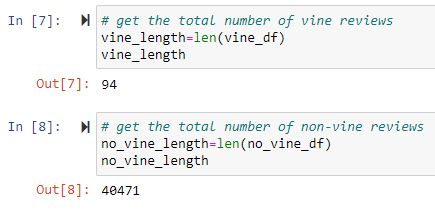
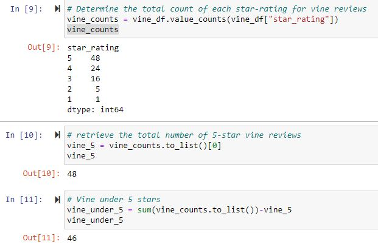
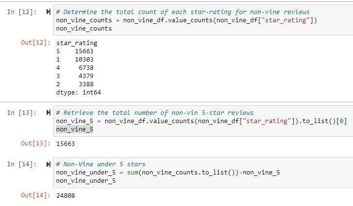
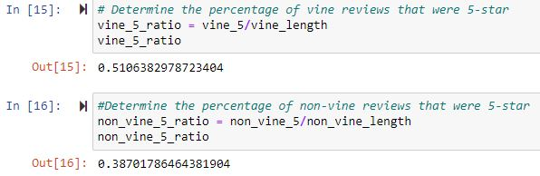

# Amazon_Vine_Analysis

## Overview

### Purpose

The purpose of this analysis is to assess whether or not the rate at which Amazon Vine reviewers give 5-star reviews of products is indicative of a bias.  This analysis made use of Google Colab to perform ETL on Amazon review data by extracting the raw data, cleaning it, and loading it into an AWS-hosted PostgreSQL database that is managed through pgAdmin.

## Results

### Data filtering

In order to filter the reviews for reviews that were more likely to be helpful, reviews were filtered first by which reviews had 20 or more votes and second by which reviews had 50% or more votes indicating that the review was helpful.

### Observations

* After filtering, there were a total of 94 Vine reviews and 40471 non-Vine reviews

* For the Vine reviews, 48 had 5 stars and 46 were under 5 stars

* For non-Vine reviews, 15,663 had 5 stars and 24,808 were under 5 stars

* Comparing the number of 5-star Vine reviews to the rest of the Vine reviews shows that 51.1% of Vine reviews are given 5 stars and comparing the number of 5-star non-Vine reviews to the rest of the non-Vine reviews shows that 38.7% of non-Vine reviews are given 5-stars.

## Summary

### Positivity Bias

From the data, there is strong suggestion that there exists bias when a review is being paid to take place.  Where only 38.&% of unpaid reveiws that have been filtered based on usefulness, paid Vine reviews indicate a 51.1% preference toward receiving a perfect score.

### Additional Analyses

Two studies would help in further assessing the positivity bias of the vine reviews.  First, repeating the full analysis without attempting to filter the results based on whether or not the review was deemed "useful" by others. Second, analyzing the number of 4-star and 5-star (highly ranked) vine reviews that received less than 50% of the votes for being deemed helpful. 